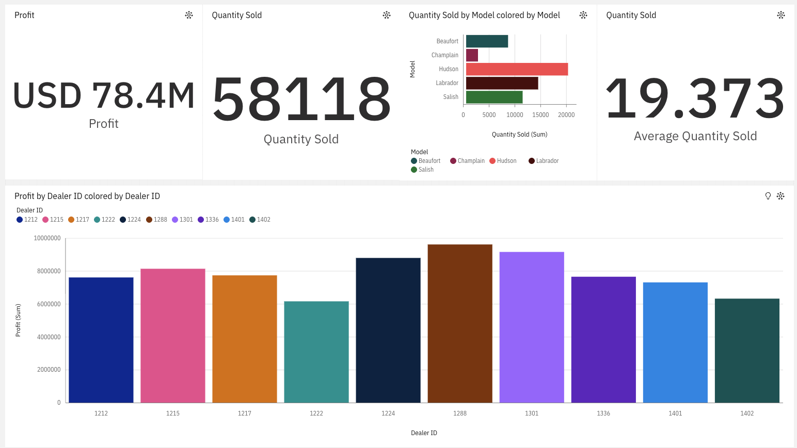
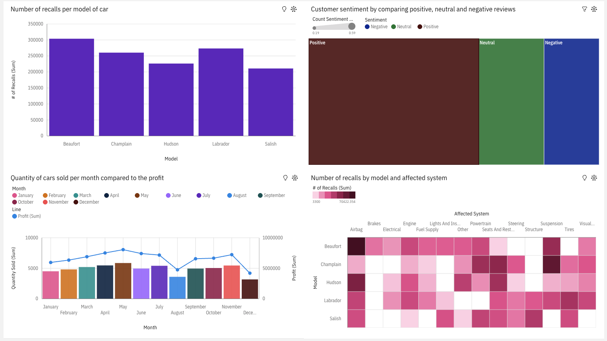

# Automotive BI Dashboards

Business Intelligence dashboards built to monitor sales performance and service quality across a multi-model automotive portfolio. Both dashboards cover the same fleet of five vehicle models — **Beaufort**, **Champlain**, **Hudson**, **Labrador**, and **Salish** — giving stakeholders a unified view from deal closure through post-sale service.

---

## Dashboard 1 — Sales Performance



### Overview
Tracks revenue, volume, and dealer-level profitability to support sales strategy and incentive planning.

### Key Metrics
| Metric | Value |
|---|---|
| Total Profit | USD 78.4M |
| Total Units Sold | 58,118 |
| Average Quantity Sold | 19,373 |

### Visualizations
- **KPI Cards** — headline profit, total units sold, and average quantity sold at a glance.
- **Quantity Sold by Model** — horizontal bar chart comparing unit volume across all five models; Hudson leads in sales volume.
- **Profit by Dealer ID** — bar chart breaking down profit contribution per dealer (IDs 1212–1402), revealing top-performing and underperforming dealerships.

---

## Dashboard 2 — Service & Quality



### Overview
Monitors post-sale service health through recall data, customer sentiment, and monthly sales-to-profit correlation.

### Visualizations
- **Recalls per Model** — bar chart showing cumulative recall counts (Beaufort and Labrador lead with ~300K+ recalls each).
- **Customer Sentiment** — treemap breaking down review sentiment into Positive, Neutral, and Negative proportions, scored on a 0.19–0.59 scale; positive sentiment dominates.
- **Monthly Sales vs. Profit** — combo chart overlaying monthly unit volume (bars) with profit trend line (Jan–Dec), highlighting seasonal dips and peaks.
- **Recalls by Model & Affected System** — heatmap cross-referencing all five models against 14 affected systems (Airbag, Brakes, Engine, Fuel Supply, Powertrain, Steering, Suspension, Tires, and more), pinpointing the highest-risk model–system combinations.

---

## Tools
These dashboards were created using a BI visualization tool (Tableau / Power BI style). The underlying dataset covers automotive sales transactions, dealer records, warranty claims, recall filings, and customer reviews.

---

## Repository Structure
```
.
├── README.md
├── Sales.png        # Sales Performance Dashboard
└── service.png      # Service & Quality Dashboard
```
